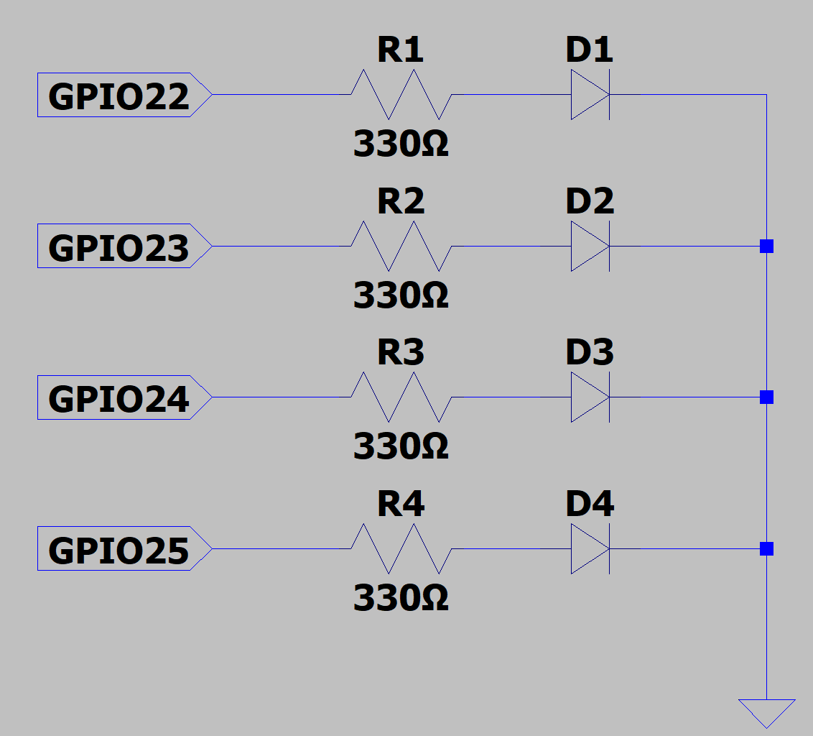

# 2020年度 ロボットシステム学 課題1

## 内容
デバイスファイルに特定の文字を書き込むことでLEDが点灯または消灯する  
- '0'～'9'，'a'～'f'を書き込むと指定した数になるまで0から順に2進数形式で表示，'a'～'f'は'10'～'15'に対応  
- 'l'を書き込むと全てのLEDが0.2秒間隔で点滅  
- 'p'を書き込むとLEDが螺旋状に点灯  

## 実験器具
- Raspberry Pi 4 Model B ×1  
- ブレッドボード ×1  
- ジャンパー線 オス-メス ×8  
- 赤色LED ×4  
- 抵抗 330Ω ×4  

## 配線
- GPIOピンのうち22，23，24，25の4個を使用，それぞれ330Ωの抵抗を挟んでLEDと接続  
- 左から接続されたGPIOピンの番号が22，23，24，25になるようにLEDを並べて配置



## 実行方法

- 以下のコマンドを順に実行
```
$ git clone https://github.com/nanocc/robosys2020_LED.git
$ cd robosys2020_LED
$ make
$ sudo insmod myled.ko
$ sudo chmod 666 /dev/myled0
```

## 操作方法

- 2進数形式で'7'，'15'になるまで順に表示
```
$ echo '7' > /dev/myled0
$ echo 'f' > /dev/myled0
```

- 全体点滅
```
$ echo 'l' > /dev/myled0
```

- 螺旋状に点灯
```
$ echo 'p' > /dev/myled0
```

## アンインストール

- 以下のコマンドを順に実行
- rmmodを実行してもLEDは消灯しないため，先に'0'を書き込んで全てのLEDを消灯する
```
$ echo '0' > /dev/myled0
$ sudo rmmod myled
```

- makeで作成された.oファイル，.koファイル等も削除したい場合はさらに以下のコマンドを実行
```
$ make clean
```

## デモムービー
https://www.youtube.com/watch?v=uLWVqd7iy64

## ライセンス
[GNU General Public License v3.0](https://github.com/nanocc/robosys2020_LED/blob/main/COPYING)
